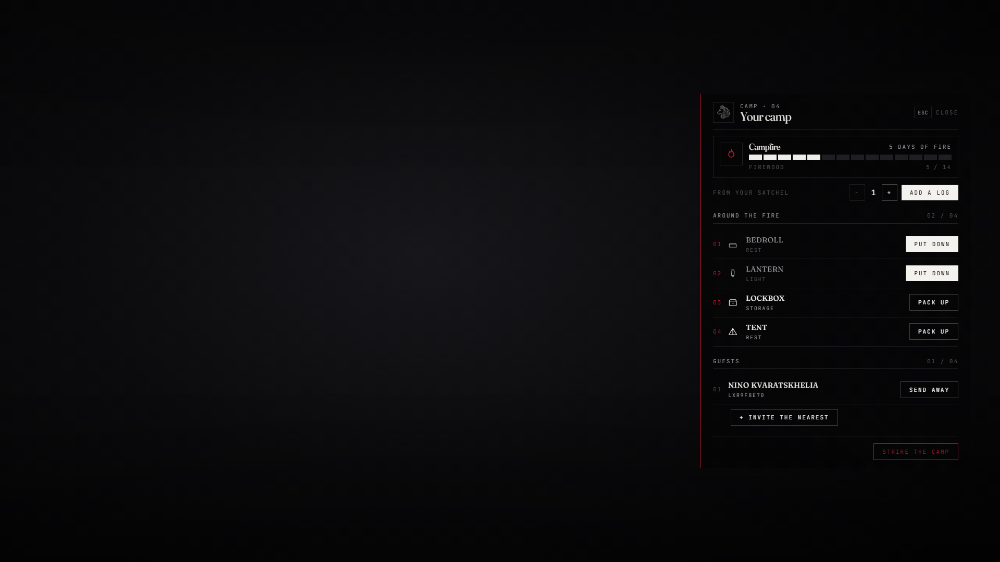

# lxr-camp — A fire and what you carry, for LXRCore

Use the `campfire_kit` away from town and a fire takes. Around it go the
pieces you carry — a tent, a bedroll, a lockbox, a lantern. The camp
lives on the server and survives restarts; it eats firewood by the day
and goes cold without it — a cold camp is struck and its pieces (and
what the lockbox held) wait for the owner's next fire. Guests are invited
to the fire; a stranger can work the lockbox with a pick. The fire is a
campfire station for lxr-craft.



## What it does

* **The fire** — `Config.Camp`: one per player, `spacing` from other camps, out of `towns`; *Tend the camp* (owner), *Cook* (lxr-craft's campfire recipes), *Warm your hands*.
* **Firewood** — `Config.Fuel`: `perDay` logs a day, `max` on the pile, `start` in a new fire; the page shows days of fire left.
* **Pieces** — `Config.Pieces`: catalog items placed from the satchel within `radius` of the fire; a `storage` piece is an lxr-inventory stash (owner and guests; picked open by others through lxr-lockpick), a `rest` piece rests you (`lxr:camp:rested` for the needs), a `light` piece is a lantern.
* **Guests** — invite the nearest, send away; up to `guests`.
* **Strike** — the owner packs the kit and the pieces come back; a cold camp goes to the lost pile that returns at the next fire.
* **Not verified in game** — prop names; a model that fails `IsModelValid` is skipped and the piece is marked by its prompt.
* **Exports** — `CampsOf(citizenid)` (for a spawn option), `Role(citizenid, campId)`.

## Install

```cfg
ensure lxr-core
ensure lxr-inventory
ensure lxr-interact
ensure lxr-craft      # optional: cooking at the fire
ensure lxr-lockpick   # optional: the pick
ensure lxr-camp
```

Tables `lxr_camps`, `lxr_camp_pieces`, `lxr_camp_lost` are created by the core migration runner.

## Building the interface

Vite + React + TypeScript: source in `ui/`, built output in `html/` (`cd ui && npm install && npm run build`). `style.css` uses kit tokens only; `tools/kit_check.py` guards it.

## Licence

© 2026 iBoss21 / LXRCore — All Rights Reserved. See `LICENSE`.
